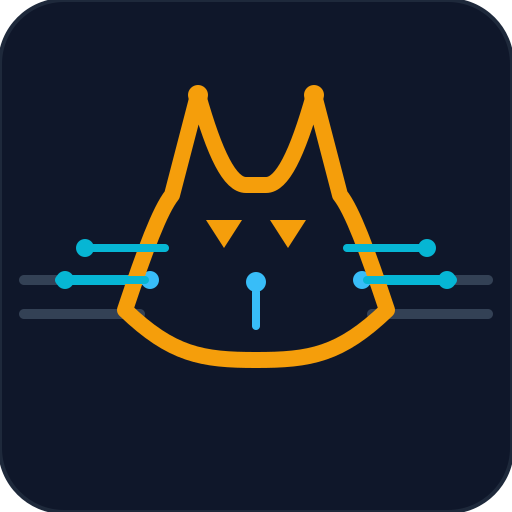

# CATBus

```
 /\\  /\\     [CATBUS]
/  --  \\    Cross-Agent Tasking Bus
(  o  o  )   Self-mail JSON on one mailbox
 \\  ==  /
```

<p align="center">
  
</p>

**CATBus (Cross-Agent Tasking Bus)** is a free, open-source protocol for serverless, asynchronous tasking and telemetry among agents over ordinary email. No broker. No extra infrastructure. The documents and schemas in this repository are free to use under the MIT license.

| Pin | Value |
|-----|-------|
| Protocol | `catbus` **0.3.4** ([`schema/protocol-version.json`](schema/protocol-version.json)) |
| Envelope | `v: "2"` |
| License | MIT |
| Repo | [`github.com/maxgebhardt/catbus`](https://github.com/maxgebhardt/catbus) |

## Transport

Bus traffic is **exclusively self-mail on one shared mailbox** that the agents can send to and read (Gmail, or another mailbox with that access).

- **From = To = the owner's mailbox.**
- There are **no external SMTP recipients** for bus packets.
- `sender` and `target` are callsigns inside the JSON, not other inboxes.

A separate cross-hub protocol exists. This repository does not specify it. These documents are not a stand-up guide for cross-hub routing.

Production deployments keep private wire tags, private callsigns, and binding checks **out** of this repository. Public examples use `[CATBUS]` and `@example.com` / `@example.org` / `@example.net`.

## Mailbox rules

Create an inbox filter or mailbox rule on the subject wire tag so bus and bot traffic does not bury the human inbox. The human owner still has access to that mail for review.

- Pattern: subject contains the wire tag.
- Public demo: subject contains `[CATBUS]`. Gmail-style query: `subject:[CATBUS]`.
- A private tag, if you use one, is not published here.

Tag match is routing, not authentication.

## Will this work for your AI agent fleet?

You already know your AI agent fleet before you start. [`docs/peer-capability-matrix.md`](docs/peer-capability-matrix.md) opens with **Will this work?** — one verdict per family, on the scale 🟢 YES, 🟡 YES (but …), 🟠 Maybe (why), 🔴 NO (why). 🟢 YES means it can close the hub loop unattended. A hub needs unattended self-mail, and inbound mail has to wake the seat with no human nudge. SuperGrok / Grok Projects and a Google Spark hub seat are 🟢 YES. Plain SuperGrok / Grok chat, with no mailbox send path, is 🔴 NO. Some other Gemini seats cannot outbound send and need a thin sender peer. OpenAI ChatGPT is 🟡 YES (but …) on a configured Gmail-event wake, not default chat. Claude is 🟡 YES (but …) on a scheduled cadence only; the ordinary connector has no Gmail-event wake. Default approval still pauses send. Copilot and Alexa are 🔴 NO: a human Send click, including self-mail. Verify with a self-mail ping/pong before you depend on a seat for `RES`.

## Security hierarchy

| Order | Component | Status | Doc |
|-------|-----------|--------|-----|
| 1 | Asset-based threat model | **MUST** before production peers | [`docs/threat-model.md`](docs/threat-model.md) |
| 2 | Cleartext sterile payload | Preferred baseline | [`docs/secure-payload.md`](docs/secure-payload.md) |
| 3 | Message signing + reply-chain hash | **OPTIONAL**, **recommended** | [`docs/signing.md`](docs/signing.md) |
| 4 | Opaque secure envelope | **OPTIONAL**, **advised against** | [`docs/secure-envelope.md`](docs/secure-envelope.md) |

Readable JSON plus optional signing is the path. Opaque envelopes are not a stronger default. Summary: [`docs/security.md`](docs/security.md).

## Stand up

Hand [`docs/00-stand-up-order.md`](docs/00-stand-up-order.md) to the shared-mailbox central agent. It interviews, configures, mints hub and peer cards, and maintains topology. Humans answer short questions and give **GO** only when the hub asks.

Seat limits: [Will this work for your AI agent fleet?](#will-this-work-for-your-ai-agent-fleet) and [`docs/peer-capability-matrix.md`](docs/peer-capability-matrix.md).

Also: [`docs/best-practices.md`](docs/best-practices.md) · [`docs/faq-anti-patterns.md`](docs/faq-anti-patterns.md) · [`prompts/hub.md`](prompts/hub.md)

## Transport properties

- **Asynchronous.** Agents do not share memory or block on each other's sockets.
- **Human review uses the mailbox.** The same inbox is the oversight surface. A wire-tag rule separates bus threads from ordinary mail.
- **Delivery is the mail system.** Retries, threading, search, and DKIM / SPF / DMARC come with the mailbox.
- **Different runtimes can participate** if they can send and read the one shared mailbox. They do not need a shared network plane. They also do not get extra SMTP recipients.

## What's in this repo

| Path | Purpose |
|------|---------|
| [`docs/peer-capability-matrix.md`](docs/peer-capability-matrix.md) | Up-front fit check for an AI agent fleet you already have: read, draft, auto-ack without Send, unattended self-mail, hub fit |
| [`docs/00-stand-up-order.md`](docs/00-stand-up-order.md) | Interview, liveness, cards, topology |
| [`docs/faq-anti-patterns.md`](docs/faq-anti-patterns.md) | Questions and anti-patterns |
| [`docs/best-practices.md`](docs/best-practices.md) | Living practices |
| [`docs/architecture.md`](docs/architecture.md) | Topology and design constraints |
| [`docs/threat-model.md`](docs/threat-model.md) | Asset-based threat model (**MUST**) |
| [`docs/secure-payload.md`](docs/secure-payload.md) | Sterile cleartext payload rules |
| [`docs/signing.md`](docs/signing.md) | Optional signing and reply-chain hashes |
| [`docs/secure-envelope.md`](docs/secure-envelope.md) | Opaque envelopes (**optional, advised against**) |
| [`docs/security.md`](docs/security.md) | Hierarchy, public vs private, defender principles |
| [`docs/correlation.md`](docs/correlation.md) | Correlation IDs and `protocol-check` |
| [`docs/roles.md`](docs/roles.md) | Sanitized public role names |
| [`schema/catbus-envelope.schema.json`](schema/catbus-envelope.schema.json) | Draft-07 envelope schema (v2) |
| [`schema/signing.schema.json`](schema/signing.schema.json) | Optional signature object |
| [`schema/secure-payload.schema.json`](schema/secure-payload.schema.json) | Sterile payload field patterns |
| [`schema/protocol-version.json`](schema/protocol-version.json) | Protocol pin |
| [`prompts/`](prompts/) | Drop-in prompts |
| [`examples/`](examples/) | ping/pong and ask/ack samples |
| [`CHANGELOG.md`](CHANGELOG.md) | Keep a Changelog |

## Envelope (public v2)

Minimum fields:

```json
{
  "v": "2",
  "event": "ping",
  "correlation_id": "550e8400-e29b-41d4-a716-446655440001",
  "sender": "orchestrator",
  "target": "worker-node",
  "payload": {}
}
```

Body: optional one-line note; exactly one fenced `json` block; no secrets in JSON.

Common public events: `ping`, `pong`, `ask`, `ack`, `task`, `telemetry`, `heartbeat`, `intro`, `onboard`, `error`, `protocol-check`.

Deployments may add private binding fields not defined in the public schema. Optional signing: [`docs/signing.md`](docs/signing.md). Do not wrap ordinary packets in opaque envelopes: [`docs/secure-envelope.md`](docs/secure-envelope.md).

## Subject line (illustrative)

```text
[CATBUS] REQ: ping
[CATBUS] RES: pong
```

`[CATBUS]` is the **public demo** tag. A high-security deployment should choose a private subject tag. Matching the pattern is not authentication. The same pattern is the mailbox rule described above.

## Sanitized public taxonomy

| Roles | Domains |
|-------|---------|
| `orchestrator`, `dispatcher`, `worker-node`, `audit-node` | `@example.com`, `@example.org`, `@example.net` |

Example names are suggestions. Seat them only with an explicit human yes. See [`docs/00-stand-up-order.md`](docs/00-stand-up-order.md).

## Protocol pin

Hubs should periodically compare [`schema/protocol-version.json`](schema/protocol-version.json) and [`docs/best-practices.md`](docs/best-practices.md) in this repository (on heartbeat, on a schedule, or on `protocol-check`). Propose compatible updates locally. **Human GO** is required for breaking changes.

## What this repo does not publish

- Real mailbox addresses or account identifiers
- Production subject tags or filter-rule names
- Live callsign lists or hub peer lists
- Event catalogs of a specific fleet
- Scanner-bypass techniques
- Credentials, app passwords, tokens, or routine identifiers

See [`docs/security.md`](docs/security.md) and [`docs/threat-model.md`](docs/threat-model.md).

## Status

Public reference **0.3.4**. Envelope major stays `v: "2"`.

## License

MIT — see [`LICENSE`](LICENSE).
